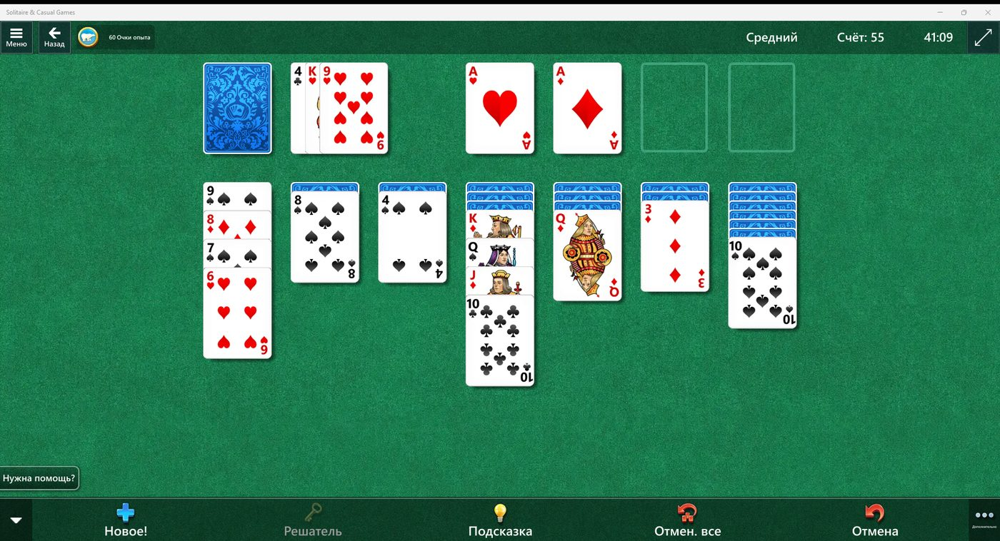
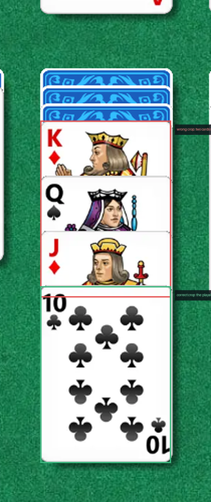

# solitaire-computer-agent

**Автономный агент, который играет в «Косынку» (Microsoft Solitaire Collection)
через реальный экран и мышь.** Ни API игры, ни чтения памяти процесса, ни
внедрённых DLL, ни доступа к внутреннему состоянию приложения: для агента игра
существует только как пиксели на входе и события мыши на выходе — ровно то же
положение, в котором находится любая computer-use система (RPA, агент в чужом
приложении, автоматизация UI без интеграции).

Распознавание карт **99,91 %** · **8,1 мс** на карту с препроцессингом ·
**40 ходов подряд** без рассинхронизации памяти и экрана.



## Почему «Косынка» — честный полигон

У игры нет API, а Microsoft Solitaire Collection — это **UWP-приложение**, а не
обычный `.exe`, поэтому привычные приёмы автоматизации просто не работают:

| Проблема UWP | Что происходит |
| --- | --- |
| Окно не видно через обычный Win32 API | Перечисление окон пустое, `MainWindowHandle = 0` |
| `BitBlt` (GDI) не снимает содержимое | Скриншот чёрный: средняя яркость 36, зелёное сукно 0 % |
| Синтетический ввод игнорируется | `mouse_event`, `SetCursorPos`, инструментальный drag отбрасываются |
| Окно живёт в `ApplicationFrameHost` | Заголовок, геометрия и клиентская область считаются иначе |

Плюс сложность самой предметной области: карты **перекрывают друг друга** в
веере, у закрытых карт не известны ни достоинство, ни масть, а состояние стола
приходится держать в памяти между действиями.

## Архитектура: Vision → Rules → Planning → Action → Verification

```
        ┌──────────────────────┐
        │  Экран игры (UWP)    │◄──────────── физическое действие ────┐
        │      1920×1040       │                                      │
        └──────────┬───────────┘                                      │
   скриншот (mss, DWM)                                                │
                   ▼                                                  │
   ┌──────────────────────────────┐                                   │
   │ Vision: геометрия + MobileNet│  кадр → Board                     │
   └──────────────┬───────────────┘                                   │
                  ▼                                                   │
   ┌──────────────────────────────┐                                   │
   │ Rule Engine: get_valid_moves │  нумерованный список ходов        │
   └──────────────┬───────────────┘                                   │
                  ▼                                                   │
   ┌──────────────────────────────┐                                   │
   │ LLM Planner (qwen2.5:14b)    │  move_index + объяснение          │
   └──────────────┬───────────────┘                                   │
                  ▼                                                   │
   ┌──────────────────────────────┐                                   │
   │ Act: SendInput клик / drag   │ ──────────────────────────────────┘
   └──────────────┬───────────────┘
                  │ новый кадр
                  ▼
   ┌──────────────────────────────┐
   │ Verification: память vs экран│  совпало → дальше
   │  verify + quantity + loop    │  не совпало → Undo и повтор
   └──────────────────────────────┘
```

| Компонент | Задача | Код |
| --- | --- | --- |
| Vision | найти стол, колонки, карты; прочитать то, что реально видно | `vision/` |
| Rule Engine | чистая логика: какие действия допустимы и что за ними следует | `orchestrator/rule_engine.py` |
| LLM Planner | выбрать **один** ход из списка и объяснить выбор | `planner/` |
| Act | превратить ход в пиксели и выполнить его физически | `act/` |
| Verification | подтвердить, что экран стал таким, каким его предсказала память | `orchestrator/verify.py`, `quantity_guard.py`, `loop_guard.py` |
| Инфраструктура | локальный сервер и веб-UI («ход / автоплей / стоп»), лог ходов | `server.py`, `web/index.html` |

**Главный архитектурный принцип:** правила считают, какие ходы *возможны*, а LLM
решает, какой из них *выбрать*. Поэтому нелегальный ход невозможен by design —
модель не придумывает действие, а выбирает из уже посчитанных.

## Результаты в цифрах

| Метрика | Значение |
| --- | --- |
| Точность классификации карт | **99,91 %** (3251/3254) на полном датасете, **100 %** (650/650) на holdout |
| Размер модели | 2 290 484 параметра / 9,4 МБ (MobileNet v2, 52 класса) |
| Задержка распознавания | **6,7 мс** чистая инференция, **8,1 мс** с кропом и препроцессингом |
| Полное чтение стола (кадр → Board) | ≈150 мс (геометрия + 12 инференсов); захват кадра ≈37 мс |
| Ходов без рассинхронизации | **40 подряд** в одном прогоне, 93 хода всего |
| Счёт под управлением ИИ | 260 (три начатых «дома») |
| Датасет | 3254 полные карты (131×176) + 3967 уголков, 52 класса |
| Тесты | 8 зрение + 9 верификация + набор правил, всё зелёное |
| Время одного хода | 5–20 с, почти всё — локальная LLM |

## Баг, который выглядел как плохая нейросеть

Самый поучительный эпизод проекта. Агент внезапно сообщал:

```
⛔ Stuck
chosen = Move 1 card(s) from column 3 to column 4
attempt 0: ok=False reason = col 4 top: mem=10♣ screen=K♠
```

Память считала, что верх колонки 4 — десятка треф, «экран» показывал короля.
При этом **права была память**: реальная играбельная карта в этой колонке —
10♣. Ошибался слой зрения. Разбор дал пять независимых первопричин:

| Причина | Чем оказалась на самом деле | Доказательство |
| --- | --- | --- |
| `open_y` указывал на **первую** открытую карту веера вместо нижней, играбельной | модели подавался склей из двух карт (верхняя полоса K♦ + лицо J♦) — ошибка **кропа**, а не модели | уверенность 0,25 и неверная масть → **1.000** на всех семи колонках после фикса |
| **Пустая колонка** ломала всю геометрию | шаг сетки считался как `median` зазоров; пустая колонка кластера не даёт, зазоры становятся кратными: `[1,2,2,1]` → медиана 1,5 шага | центры `203…1715` → `455…1463`, «размер карты» 197×265 → 131×176 |
| Верх стола **угадывался** (`int(H*0.33)` = 343 вместо реальных 350) | король, сброшенный в пустую колонку, попадал на 7 px выше слота и отбраковывался проверкой количества | ход отклонялся → верх измерен, ход принят |
| Сброс и талон после **перезапуска посреди партии** | верхняя карта сброса перечитывалась только при наличии заглушки, а «точечный фикс» был заглушкой-обманкой, возвращавшей «исправлено» без записи | `waste: mem=J♣ screen=5♦`; 8 из 10 ходов падали → 20 из 20 прошли |
| **Синий портрет** дамы треф принимался за рубашку | признак «рубашка» считался по центральной полосе, а портрет фигуры тоже синий | доля синего: рубашка 1.000, Q♣ 0.214, остальные 0.000 |



Инвариант «`open_y` — верх нижней, играбельной карты» был **написан в
комментариях** — и в модуле кликов, и в модуле верификации. Реализация его не
выполняла, а комментарии компилятор не проверяет. Именно поэтому финальным
артефактом проекта стали регресс-тесты на реальных кадрах: три настоящих
скриншота с эталоном, прочитанным глазами, вплоть до масти каждой видимой карты.

Подробный разбор (все пять причин, таблица констант, лог тестов) —
[`docs/engineering-notes.md`](docs/engineering-notes.md).

## Как это тестировалось

```bash
python tests/test_screen_to_board_real_frame.py   # 8/8  — зрение на 3 РЕАЛЬНЫХ кадрах
python tests/test_verify.py                       # 9/9  — геометрия верификации хода
python tests/test_rule_engine.py                  # генерация допустимых ходов
python tests/test_calibration.py                  # сетка колонок и верх стола
python scripts/_autoplay_probe.py 10              # N живых ходов + независимая сверка памяти и экрана
```

Живой прогон делает N ходов через API сервера и после каждого хода независимо
снимает кадр, читает стол своим зрением и сравнивает с памятью сервера (верх
колонок, верх сброса, «дома»). Результаты: середина партии 20 ходов — 0
расхождений, свежая раздача 40 ходов — 0, продолжение 21 ход — 0, контрольный
прогон 12 ходов — 0.

## Установка

Windows 10/11 (проект использует WinAPI, `mss` и `pywin32`), Python 3.10+:

```bash
git clone https://github.com/YanChi-pixel/solitaire-computer-agent.git
cd solitaire-computer-agent
python -m venv .venv && .venv\Scripts\activate
pip install -r requirements.txt
```

LLM-стратег настраивается в `.env`:

* **Ollama** (по умолчанию, локально и бесплатно): `ollama pull qwen2.5:14b`
* **DeepSeek API** или любой OpenAI-совместимый endpoint: `LLM_BACKEND=deepseek`
  и `DEEPSEEK_API_KEY`

Скопируйте `.env.example` в `.env` и заполните. `.env` в репозиторий не попадает.

## Запуск

Игра должна быть открыта и видна на экране:

```bash
python server.py        # веб-UI на http://127.0.0.1:8000
python play.py          # один ход из консоли
start.bat               # в один клик: освободить порт 8000, поднять сервер, открыть браузер
```

В веб-UI кнопки **Make a move**, **Auto play**, **Stop**; каждый ход
сопровождается объяснением LLM на человеческом языке — ради этого LLM здесь и
используется.

## Обучение своего распознавателя

Опубликованный `model.pth` обучен на 3254 картах, собранных из живой игры:

```bash
python scripts/collect_full.py          # насобирать ПОЛНЫЕ карты во время игры
python scripts/sort_full.py             # разложить их в dataset_full/<rank>_<suit>/
python scripts/train_model.py           # дообучить MobileNet v2 → model.pth
python scripts/_model_metrics.py        # точность, пары путаницы, латентность
```

Более ранний конвейер (уголки 42×54, папка `dataset/`) тоже остался в репо:
`vision/dataset_collector.py` → `scripts/label_corners.py` (или `auto_label.py`
локальной vision-моделью) → `dataset/<rank>_<suit>/`. От него отказались в пользу
полных карт: модель читает целую карту заметно надёжнее, чем маленький уголок.

Порядок классов, который выдаёт модель, лежит в `vision/classes.json` и
совпадает с `torchvision.datasets.ImageFolder` (алфавитный порядок папок).
Если переобучаете на другом наборе классов — обновите и его.

## Инварианты зрения (ломать нельзя)

1. **`open_y` — верх НИЖНЕЙ (играбельной) открытой карты колонки**, а не первой
   открытой под рубашками. На это опираются `layout.open_y`,
   `apply_move_to_screen`, `verify.check_shift`, `verify_quantity` и все пути
   «перечитать карту».
2. Распознаются только **полностью видимые** карты: играбельная карта колонки,
   верх веера сброса, количество рубашек в талоне, верхи «домов». Перекрытые
   карты ведёт память (`apply_move`).
3. Порядок строк в колонке — структурный, а не пороговый: рубашки идут сплошной
   группой сверху, первая открытая карта начинается на первом длинном белом
   прогоне.
4. **Шаг сетки колонок = МИНИМАЛЬНЫЙ зазор** между найденными колонками (пустая
   колонка не даёт кластера, а остальные зазоры кратны шагу).
5. «Это рубашка?» решается по **всей площади карты** с отступом от края: рубашка
   синяя от края до края (1.000), портрет фигуры — около 0.2.
6. Веер сброса — это веер: читается только его правая карта, и экран для неё
   авторитетен. Наличие талона тоже читается с экрана.
7. `table_top_y` **измеряется** по непустым колонкам, а не угадывается долей
   высоты кадра.

## Структура

```
act/            управление мышью (SendInput), захват экрана, раскладка элементов
vision/         калибровка, извлечение карт, распознаватель MobileNet, кадр → Board
orchestrator/   rule engine, верификация, quantity guard, loop guard
planner/        контракт промпта, разбор JSON, бэкенды LLM (mock/ollama/openai)
scripts/        обучение, разметка, сбор данных, бенчмарки, диагностика, прогоны
tests/          регресс-тесты; tests/data/*.png — РЕАЛЬНЫЕ кадры, их надо хранить
web/index.html  веб-UI: кнопки, состояние стола, объяснения LLM
server.py       локальный HTTP-сервер, связанный с живой игрой
play.py         один ход из консоли
dataset/        3967 уголков, 52 класса (более ранний конвейер)
model.pth       обученные веса MobileNet v2 (9,4 МБ, 52 класса)
docs/           инженерные заметки (RU), картинки для README
hf/             рецепты публикации модели, датасета и демо-Space на Hugging Face
```

Полный набор полных карт (3254 изображения 131×176) в репозиторий не положен,
чтобы не раздувать его: скрипты публикации — в `hf/`, а собрать свой такой же
набор можно командой `scripts/collect_full.py`.

## Hugging Face

Слой зрения опубликован отдельным артефактом: веса скачиваются одной строкой,
датасет доступен целиком, а демо открывается в браузере.

| | |
| --- | --- |
| 🃏 **Распознаватель** | [huggingface.co/WildFuria/solitaire-card-recognizer](https://huggingface.co/WildFuria/solitaire-card-recognizer) — `model.pth`, `classes.json`, метрики и ограничения |
| 📦 **Датасет** | [huggingface.co/datasets/WildFuria/solitaire-cards-dataset](https://huggingface.co/datasets/WildFuria/solitaire-cards-dataset) — 3254 полные карты + 3967 уголков + регресс-фикстуры |
| 🚀 **Живое демо** | [huggingface.co/spaces/WildFuria/solitaire-card-recognizer-demo](https://huggingface.co/spaces/WildFuria/solitaire-card-recognizer-demo) — считает **прямо в браузере** через ONNX Runtime Web |

```python
from huggingface_hub import hf_hub_download

weights = hf_hub_download("WildFuria/solitaire-card-recognizer", "model.pth")
```

Демо — это *статический* Space: `model.pth` экспортируется в ONNX скриптом
`hf/export_onnx.py`, а инференс делает браузер, поэтому там нет сервера и нет
холодного старта. Gradio/Docker Spaces на бесплатном `cpu-basic` требуют
PRO-подписки, статические — бесплатны. Рецепты повторной публикации — в
[`hf/`](hf/README.md).

## Ограничения и что осталось за кадром

* **Перекрытые карты не читаются зрением** — это физика задачи, а не баг.
  Состав веера восстанавливается памятью, поэтому запуск сервера посреди партии
  даёт «частичную» память: она дообучается по ходу игры, но идеальной не станет.
* **Реклама в игре.** Новая раздача запускается меню самой игры, перед ней может
  проигрываться реклама — автоматизировать клики по чужому рекламному экрану
  намеренно не стали.
* **Скорость упирается в LLM**: зрение занимает доли секунды, а ход — 5–20 с из-за
  локальной модели на 14B. Помогает модель меньше или GPU с большей памятью.
* **Стратегия среднего уровня.** Правила промпта и антишаффл-фильтры дают
  аккуратную, но не оптимальную игру: полный решатель «Косынки» с перебором
  показал бы лучше. LLM здесь не для силы, а для объяснимости.
* **Только Windows** — из-за WinAPI-ввода и захвата UWP-окна.

## Лицензия и оговорка

MIT — см. [LICENSE](LICENSE).

Скриншоты в `tests/data/` и `docs/img/` показывают интерфейс Microsoft Solitaire
Collection и используются как тестовые фикстуры в исследовательских и учебных
целях. Проект не связан с Microsoft. MobileNet v2 — из `torchvision`
(BSD-3-Clause). Агент управляет мышью и клавиатурой вашей машины: запускайте его
на рабочем столе, который видите и можете остановить.

---

In English: [README.md](README.md) · Инженерные заметки: [docs/engineering-notes.md](docs/engineering-notes.md)
